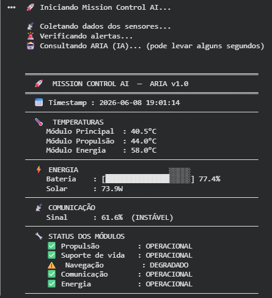
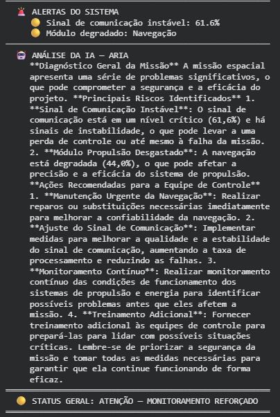

# Mission Control AI — ARIA

**Integrantes:**
- Enzo Stahal Freitas — RM: 569001
- Matheus Bruno de Lima — RM: 572944

O ARIA é um sistema de monitoramento de missão espacial que gera dados simulados de sensores como temperatura, energia e comunicação, analisa ess…O Mission Control AI é um sistema de monitoramento de missão espacial que gera dados simulados de sensores como temperatura, energia e comunicação, analisa esses dados automaticamente e emite alertas classificados por nível de severidade. A inteligência artificial está integrada ao sistema por meio do modelo de linguagem Llama 3.2, que recebe todos os dados e alertas coletados e produz um diagnóstico completo em linguagem natural, com identificação de riscos e recomendações de ação para a equipe de controle. A combinação de IA baseada em regras para decisões imediatas e IA generativa para análise contextual torna o sistema capaz de responder tanto a situações críticas simples quanto a cenários operacionais mais complexos.

 ## Demonstração

 ## Como Executar

Abra o notebook no Google Colab:
[Acessar Notebook](https://colab.research.google.com/drive/1rIoTxQNqBNuYl22CPIhU_XxV8V1vd2Ej#scrollTo=xblmEJainDGy)

## Vídeo de Demonstração

[Assistir ao vídeo](https://youtu.be/vsipjIIAq1g)
